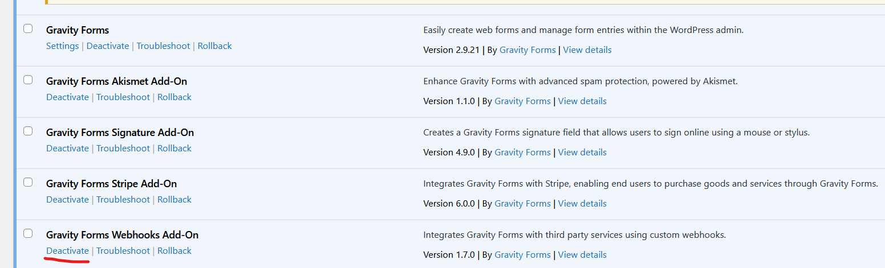

# Josiah Said Webhook Addon Issue
## Specific Issue
I installed the official webhook addon for gravity forms. Once I enabled the addon, the webhook tab under "form settings" does not appear. 
## Expected behavior
Since the addon is enabled, A setting titled "Webhooks" should appear as a tab under form settings. 
## Troubleshooting steps taken 
* Reinstalled Addon
* Cleared cache
* Enabled "No Conflict Mode" in gravity forms
  
Here is a picture showing the webhook addon and gravity forms plugin both installed/enabled. 

Here is a picture showing that the webhook setting does not appear under form settings. 
.png)

## Addon list 
Activity Log
Add Admin CSS
Add Admin JavaScript
Admin Columns Pro
Admin Menu Editor
Adminimize
Advanced Custom Fields PRO
Akismet Anti-spam: Spam Protection
Big File Uploads
Cherry Team Members
Cue
Embed Plus for YouTube Gallery, Livestream and Lazy Loading with Facades
Envira Gallery
Events Made Easy
EWWW Image Optimizer
Export Plugin Details
Functionality
Google Analytics for WordPress by MonsterInsights
GP File Upload Pro
GP Nested Forms
GP Populate Anything
Gravity Forms
Gravity Forms Akismet Add-On
Gravity Forms Signature Add-On
Gravity Forms Stripe Add-On
Gravity Forms Webhooks Add-On
Gravity Forms Weekly Entry Checker
GravityCalendar
GravityCharts
GravityExport
GravityExport Lite
GravityMath
GravityView
GravityView - Advanced Filter Extension
GravityView - DataTables Layout
GravityView - DIY Layout
Health Check & Troubleshooting
Hide Admin Bar Based on User Roles
Import and export users and customers
Juicer
Limit Login Attempts Reloaded
LoginPress
LoginPress Pro
ManageWP - Worker
Members
More Sorting Options for WooCommerce
Ninja Forms
Ninja Forms - Addon Manager
Ninja Forms - Conditional Logic
Ninja Forms - File Uploads
Ninja Forms - Layout & Styles
Ninja Forms - Multi-Part Forms
Ninja Forms - Signature
Ninja Forms - Stripe
Post SMTP
Private Content Login Redirect
PublishPress Future
PushEngage
Really Simple Security
Redirection
Role Based Redirect
Sermon Manager for WordPress
Server IP & Memory Usage Display
Slider Revolution
Solid Security Pro
Spellbook
SVG Support
Tidio Chat
UberMenu 3 - The Ultimate WordPress Mega Menu
Use Any Font
User Role Editor
WP Mail Logging
WP Rocket
WP Rollback
WPCode Lite
Yoast SEO
